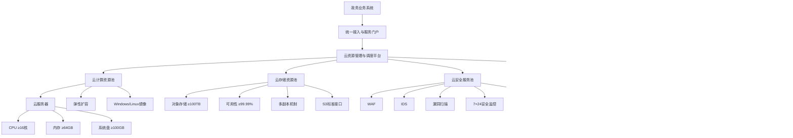
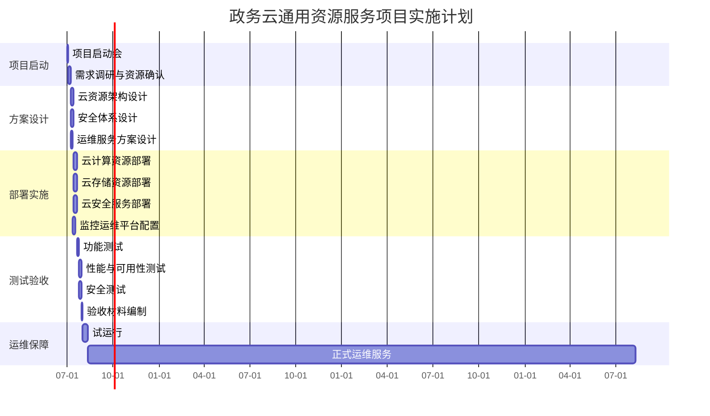

# XX 市政务云通用资源服务项目投标文件完整包

> 版本属性：OPC 竞赛投标通用模板  
> 内容边界：以下内容为通用行业模板，贴合政企云投标真实业务逻辑，但不包含任何真实客户、真实项目、真实合同、真实业绩或机密信息。正式投标前，须以投标人真实、可验证、可披露材料替换占位内容。

---

## 0. 投标文件总目录

1. 投标函
2. 法定代表人身份证明
3. 法定代表人授权委托书
4. 资格证明文件
5. 非联合体投标承诺函
6. 商务条款响应文件
7. 报价文件与报价策略
8. 技术方案
9. 项目实施方案
10. 售后服务与运维保障方案
11. 云安全服务方案
12. 业绩佐证与资质材料
13. 技术参数响应表
14. 商务偏离表
15. 合规自检与废标风险闭环
16. 评分策略与冠军级结论

---

# 第一册 商务文件

## 1. 投标函

致：__________〔采购人名称〕

根据贵方发布的《XX 市政务云通用资源服务项目》招标文件，我方经认真研读招标文件全部内容，充分理解项目建设目标、采购范围、技术要求、商务要求、服务期限、付款方式、投标文件格式及评审办法，现正式提交本项目投标文件。

我方郑重承诺：

1. 我方为依法设立并有效存续的独立法人单位，具备独立承担民事责任的能力。
2. 我方完全响应招标文件关于本项目服务期限、质保期、付款方式、服务响应、驻场运维、云资源服务及云安全服务等要求。
3. 我方承诺本项目投标报价不超过招标文件规定的预算金额 500 万。
4. 我方承诺本项目不以联合体形式参与投标。
5. 我方承诺所提交的投标文件、资格证明、技术响应、商务响应、业绩材料均真实、准确、完整、有效。
6. 如我方中标，将严格按照招标文件、投标文件及合同约定履行全部义务，确保项目按期、保质、安全、稳定交付。

投标人名称：__________〔加盖公章〕  
法定代表人或授权代表：__________〔签字或盖章〕  
日期：______年______月______日

---

## 2. 法定代表人身份证明

单位名称：__________  
单位性质：__________  
地址：__________  
成立时间：______年______月______日  
经营期限：__________  
姓名：__________  
性别：__________  
年龄：__________  
职务：__________  

兹证明__________为我单位法定代表人。

特此证明。

投标人名称：__________〔加盖公章〕  
日期：______年______月______日

---

## 3. 法定代表人授权委托书

致：__________〔采购人名称〕

本人__________系__________〔投标人名称〕的法定代表人，现授权__________为我方合法代理人，以我方名义参加《XX 市政务云通用资源服务项目》的投标活动。

授权范围包括但不限于：

1. 获取、澄清、确认招标文件；
2. 编制、签署、递交投标文件；
3. 参加开标、评标相关活动；
4. 签署与本项目投标相关的文件；
5. 处理投标过程中的其他相关事务。

授权期限：自本授权书签署之日起至本项目投标活动结束止。

法定代表人：__________〔签字或盖章〕  
授权代表：__________〔签字〕  
投标人名称：__________〔加盖公章〕  
日期：______年______月______日

---

## 4. 非联合体投标承诺函

致：__________〔采购人名称〕

我方已认真阅读本项目招标文件中关于联合体投标的相关要求，现郑重承诺如下：

1. 我方以独立投标人身份参与本项目投标；
2. 我方不以联合体形式参与本项目投标；
3. 我方不存在与其他单位组成联合体或变相联合体参与本项目投标的情形；
4. 如我方中标，将独立承担本项目合同责任；
5. 我方承诺不将本项目主体、关键性工作违法转包或分包。

如违反上述承诺，我方愿依法承担全部责任。

投标人名称：__________〔加盖公章〕  
法定代表人或授权代表：__________〔签字或盖章〕  
日期：______年______月______日

---

## 5. 商务条款响应表

| 序号 | 招标商务要求 | 投标响应 | 偏离情况 | 说明 |
|---|---|---|---|---|
| 1 | 预算金额：500 万 | 响应，投标报价不超过 500 万 | 无偏离 | 报价文件中明确总价 |
| 2 | 服务期限：3 年 | 响应，服务期限为 3 年 | 无偏离 | 自合同签订之日起计算 |
| 3 | 付款方式：30%/60%/10% | 响应 | 无偏离 | 按合同约定执行 |
| 4 | 质保期：3 年 | 响应，质保期 3 年 | 无偏离 | 自验收合格之日起计算 |
| 5 | 7×24 小时服务 | 响应 | 无偏离 | 建立全天候值守机制 |
| 6 | 故障响应时间 ≤1 小时 | 响应，承诺 ≤1 小时 | 无偏离 | 重大故障立即响应 |
| 7 | 至少 2 名专职驻场运维工程师 | 响应，不少于 2 名 | 无偏离 | 提供驻场人员安排 |
| 8 | 投标保证金 5 万 | 响应 | 无偏离 | 按招标文件规定缴纳 |
| 9 | 不接受联合体投标 | 响应 | 无偏离 | 提供非联合体承诺函 |

---

## 6. 报价策略与报价文件模板

### 6.1 报价策略

本项目预算金额为 500 万，报价策略应遵循以下原则：

1. **不得超过预算上限**：总价必须 ≤500 万。
2. **避免异常低价**：报价过低可能引发履约能力质疑，应保留合理资源、人员、安全服务和运维成本。
3. **突出性价比**：报价说明应体现 3 年服务期内云资源、安全服务、驻场运维和持续保障投入。
4. **分项清晰**：建议将云计算、云存储、云安全、运维服务、实施交付分别列项。
5. **大小写一致**：总价、分项合计、投标函金额、报价表金额必须一致。

### 6.2 报价汇总表模板

| 序号 | 报价项目 | 服务内容 | 三年总价，万元 | 备注 |
|---|---|---|---:|---|
| 1 | 云计算资源服务 | 云服务器、镜像、弹性扩容、资源监控 | ___ | 不低于招标参数 |
| 2 | 云存储资源服务 | 对象存储 ≥100TB、多副本、S3 接口 | ___ | 可用性 ≥99.99% |
| 3 | 云安全服务 | WAF、IDS、漏洞扫描、安全评估 | ___ | 每年至少 2 次评估 |
| 4 | 运维服务 | 7×24 监控、≤1 小时响应、驻场服务 | ___ | 不少于 2 名驻场 |
| 5 | 实施交付服务 | 调研、部署、测试、验收、培训 | ___ | 含项目管理 |
| 合计 |  |  | ___ | 不超过 500 万 |

---

# 第二册 技术文件

## 7. 项目理解

本项目旨在为政务业务系统提供统一、稳定、安全、弹性、可持续的云计算、云存储、云安全及运维服务能力。项目核心不是单一资源采购，而是围绕政务应用长期稳定运行，构建“资源供给、安全防护、持续运维、风险闭环”的综合服务体系。

本方案围绕以下目标展开：

1. 提供满足招标要求的云计算资源能力；
2. 提供不低于 100TB 的对象存储服务能力；
3. 提供 WAF、IDS、漏洞扫描、安全监控和安全评估能力；
4. 建立 7×24 小时运维响应机制；
5. 配置不少于 2 名专职驻场运维工程师；
6. 保障 3 年服务期和 3 年质保要求；
7. 实现关键参数无负偏离，核心服务可验证、可交付、可运维。

---

## 8. 总体技术架构

---

## 9. 云计算资源服务方案

### 9.1 云服务器服务

提供标准化云服务器资源，满足政务业务系统部署、迁移、运行和扩容要求。

| 参数 | 招标要求 | 投标响应 |
|---|---|---|
| CPU | ≥16 核 | 满足，提供不低于 16 核配置 |
| 内存 | ≥64GB | 满足，提供不低于 64GB 配置 |
| 系统盘 | ≥100GB | 满足，提供不低于 100GB 系统盘 |
| 操作系统 | Windows/Linux | 满足，支持主流 Windows/Linux 镜像 |
| 扩容能力 | 支持弹性扩容 | 满足，支持按需扩展计算资源 |

### 9.2 计算服务能力

1. 云服务器实例创建、变更、释放；
2. CPU、内存、磁盘、网络资源按需配置；
3. 支持业务系统快速部署；
4. 支持资源使用率监控和容量预警；
5. 支持快照、备份和变更回退；
6. 支持生产、测试、预发布环境隔离。

---

## 10. 云存储资源服务方案

本项目提供对象存储服务，容量不低于 100TB，可用性不低于 99.99%，支持多副本存储机制和标准 S3 接口。

| 参数 | 招标要求 | 投标响应 |
|---|---|---|
| 存储类型 | 对象存储 | 满足 |
| 容量 | ≥100TB | 满足，提供不低于 100TB 容量 |
| 可用性 | ≥99.99% | 满足 |
| 数据可靠性 | 多副本 | 满足，采用多副本机制 |
| 接口 | S3 标准接口 | 满足，兼容 S3 接口 |

对象存储服务能力包括：

1. 非结构化数据存储；
2. 政务附件、文档、日志、备份数据存储；
3. 多副本可靠性保障；
4. S3 兼容接入；
5. 权限控制与访问审计；
6. 容量监控与扩展；
7. 生命周期管理。

---

## 11. 云安全服务方案

### 11.1 安全服务总体思路

构建“事前预防、事中监测、事后处置、持续改进”的云安全服务体系，覆盖网络、主机、应用、数据和运维过程。

### 11.2 WAF 服务

提供 Web 应用防火墙能力，防护 SQL 注入、XSS、目录遍历、恶意扫描、WebShell 上传等常见 Web 攻击。

### 11.3 IDS 入侵检测

提供入侵检测系统，持续监测异常流量、攻击行为、违规访问和潜在横向移动风险。

### 11.4 漏洞扫描

针对主机、Web 应用、中间件、数据库等对象开展漏洞扫描，输出风险等级、整改建议和复测结果。

### 11.5 7×24 安全监控与应急响应

提供全天候安全监控服务，对高危告警、安全事件和重大异常进行快速研判和应急处置。

### 11.6 安全评估

每年至少开展 2 次安全评估，输出安全评估报告、风险清单、整改建议和复测结果。

---

## 12. 实施计划

---

## 13. 验收方案

| 类别 | 验收项 | 验收标准 |
|---|---|---|
| 云服务器 | CPU | 单实例 CPU ≥16 核 |
| 云服务器 | 内存 | 单实例内存 ≥64GB |
| 云服务器 | 系统盘 | 系统盘 ≥100GB |
| 云服务器 | 镜像 | 支持 Windows/Linux |
| 云服务器 | 扩容 | 支持弹性扩容 |
| 对象存储 | 容量 | ≥100TB |
| 对象存储 | 可用性 | ≥99.99% |
| 对象存储 | 接口 | 支持 S3 标准接口 |
| 云安全 | WAF | 可提供 Web 应用防护 |
| 云安全 | IDS | 可提供入侵检测 |
| 云安全 | 漏洞扫描 | 可输出扫描报告 |
| 安全服务 | 安全评估 | 每年至少 2 次 |
| 运维服务 | 响应时间 | 故障响应 ≤1 小时 |
| 运维服务 | 驻场人员 | 不少于 2 名专职运维工程师 |

---

## 14. 售后服务与运维保障

### 14.1 服务承诺

1. 提供 7×24 小时服务；
2. 故障响应时间不超过 1 小时；
3. 配备不少于 2 名专职驻场运维工程师；
4. 提供 3 年质保服务；
5. 定期输出巡检报告、运行报告、安全评估报告；
6. 建立工单闭环、故障升级和应急响应机制。

### 14.2 服务团队

| 角色 | 职责 |
|---|---|
| 项目经理 | 项目统筹、进度管理、质量控制、沟通协调 |
| 云平台工程师 | 云服务器、对象存储、镜像、资源调度支持 |
| 安全工程师 | WAF、IDS、漏洞扫描、安全评估、应急响应 |
| 驻场运维工程师 | 日常监控、巡检、故障处理、现场支持 |
| 服务台人员 | 工单受理、问题跟踪、服务记录 |

### 14.3 故障响应机制

| 故障等级 | 描述 | 响应要求 | 处理机制 |
|---|---|---|---|
| 一级 | 核心业务不可用或重大安全事件 | ≤1 小时 | 启动应急机制，优先恢复 |
| 二级 | 重要业务受影响 | ≤1 小时 | 快速定位，限时处理 |
| 三级 | 一般功能异常 | ≤1 小时 | 按流程处理并跟踪 |
| 四级 | 咨询、配置调整 | ≤1 小时 | 远程或现场支持 |

---

# 第三册 业绩佐证与资质材料

## 15. 资质材料清单

| 序号 | 材料名称 | 用途 | 形式 |
|---|---|---|---|
| 1 | 营业执照或法人登记证书 | 证明独立法人资格 | 加盖公章复印件 |
| 2 | ISO27001 认证证书 | 证明信息安全管理体系能力 | 有效期内证书 |
| 3 | ISO27001 有效性查询截图 | 辅助证明证书有效 | 截图或说明 |
| 4 | 法定代表人身份证明 | 证明法定代表人身份 | 原件或盖章件 |
| 5 | 授权委托书 | 授权投标代表 | 原件 |
| 6 | 财务报表或审计报告 | 证明财务制度健全 | 近年材料 |
| 7 | 纳税证明 | 证明依法纳税 | 完税证明 |
| 8 | 社保缴纳证明 | 证明依法缴纳社保 | 缴费证明 |
| 9 | 同类项目业绩证明 | 证明政务云经验 | 合同/验收/中标材料 |
| 10 | 非联合体承诺函 | 响应不接受联合体 | 盖章承诺函 |

---

## 16. 同类业绩摘要表模板

> 以下 A/B/C 均为虚拟脱敏模板，不代表真实项目。正式投标时必须替换为真实、可核验业绩。

| 序号 | 项目名称 | 客户类型 | 时间范围 | 项目内容 | 同类性说明 | 证明材料 |
|---|---|---|---|---|---|---|
| 1 | 某市级政务云资源扩容与运维服务项目A | 市级政务信息化单位 | 2023 年以后 | 云资源扩容、运维、安全保障 | 与本项目高度相关 | 合同、验收、服务报告 |
| 2 | 某省级部门政务云安全运营项目B | 省级政务部门 | 2023 年以后 | 安全监控、漏洞扫描、应急响应 | 与云安全服务相关 | 合同、安全报告、履约证明 |
| 3 | 某区县政务云迁移与资源管理项目C | 区县级政务单位 | 2023 年以后 | 应用迁移、云资源配置、运维支撑 | 与云资源服务相关 | 合同、迁移方案、验收证明 |

---

## 17. 业绩证明装订建议

每个业绩建议独立成组，顺序如下：

1. 业绩摘要页；
2. 合同首页；
3. 合同服务内容页；
4. 合同金额页，如招标要求需要；
5. 合同签章页；
6. 验收报告或阶段确认单；
7. 履约评价或服务证明；
8. 与项目相关的服务报告节选。

正式投标时须注意：

- 不得将虚拟模板作为真实业绩提交；
- 业绩时间须满足 2023 年 1 月 1 日至今；
- 至少提供 3 个同类政务云项目；
- 敏感信息可按规则脱敏，但关键真实性信息应保留；
- 合同主体、投标主体、证书主体应保持一致。

---

# 第四册 合规自检与评分策略

## 18. 技术参数响应表

| 招标要求 | 投标响应 | 偏离情况 |
|---|---|---|
| 云服务器 CPU ≥16 核 | 满足，提供不低于 16 核 | 无偏离 |
| 内存 ≥64GB | 满足，提供不低于 64GB | 无偏离 |
| 系统盘 ≥100GB | 满足，提供不低于 100GB | 无偏离 |
| 支持弹性扩容 | 满足 | 无偏离 |
| 支持 Windows/Linux 镜像 | 满足 | 无偏离 |
| 对象存储容量 ≥100TB | 满足 | 无偏离 |
| 可用性 ≥99.99% | 满足 | 无偏离 |
| 支持多副本 | 满足 | 无偏离 |
| 提供标准 S3 接口 | 满足 | 无偏离 |
| 提供 WAF | 满足 | 无偏离 |
| 提供 IDS | 满足 | 无偏离 |
| 提供漏洞扫描 | 满足 | 无偏离 |
| 7×24 安全监控和应急响应 | 满足 | 无偏离 |
| 每年至少 2 次安全评估报告 | 满足 | 无偏离 |

---

## 19. 废标风险清单

| 风险编号 | 风险事项 | 风险等级 | 触发后果 | 整改动作 |
|---|---|---|---|---|
| R1 | ISO27001 证书缺失或过期 | 高 | 资格不通过 | 立即核验证书有效期 |
| R2 | 同类政务云业绩不足 3 个 | 高 | 资格风险或业绩失分 | 补齐 3 个以上证明材料 |
| R3 | 投标保证金未缴或缴纳错误 | 高 | 投标无效 | 按要求缴纳 5 万保证金 |
| R4 | 报价超过 500 万 | 高 | 报价无效 | 控制报价上限 |
| R5 | 关键技术参数负偏离 | 高 | 技术响应不通过或严重扣分 | 参数表逐项无偏离响应 |
| R6 | 驻场人员少于 2 名 | 高 | 商务条款不满足 | 配置不少于 2 名驻场工程师 |
| R7 | 故障响应超过 1 小时 | 高 | 服务要求不满足 | 承诺 ≤1 小时响应 |
| R8 | 投标文件缺项 | 高 | 形式审查风险 | 按 8 项格式逐项检查 |
| R9 | 联合体投标 | 高 | 违反资格要求 | 单一主体投标 |
| R10 | 安全评估次数不足 | 中 | 技术或服务扣分 | 明确每年至少 2 次安全评估 |

---

## 20. P0/P1/P2 整改优先级

### P0：必须立即完成

1. 核验独立法人资格文件；
2. 核验 ISO27001 证书有效性；
3. 准备不少于 3 个同类政务云业绩；
4. 缴纳或准备投标保证金 5 万；
5. 确保报价不超过 500 万；
6. 确认不以联合体形式投标；
7. 检查投标文件组成是否完整；
8. 确认所有签字、盖章、日期、主体名称一致。

### P1：高优先级优化

1. 完善技术参数逐条响应表；
2. 强化云服务器、对象存储、安全服务的实现说明；
3. 补充 7×24 运维服务机制；
4. 明确 ≤1 小时故障响应流程；
5. 明确 2 名驻场工程师配置；
6. 完善每年至少 2 次安全评估计划；
7. 优化报价合理性说明。

### P2：表达增强

1. 增加架构图、流程图、甘特图；
2. 增加风险闭环图；
3. 优化目录、页码、附件索引；
4. 全文统一术语、项目名称、金额单位；
5. 关键优势前置并表格化呈现。

---

## 21. 评分攻坚表

| 评分项 | 分值 | 攻坚重点 | 目标 |
|---|---:|---|---|
| 技术方案 | 40 | 架构合理、参数无偏离、安全运维完整、实施可落地 | 争取高分 |
| 项目业绩 | 30 | 至少 3 个同类政务云业绩，材料真实完整可核验 | 力争满分 |
| 售后服务 | 20 | 7×24、≤1 小时、2 名驻场、3 年质保、定期报告 | 争取高分 |
| 投标报价 | 10 | 不超预算、合理低价、避免异常低价 | 保持竞争力 |

---

## 22. 最终提交前检查清单

| 检查项 | 是否完成 |
|---|---|
| 营业执照或法人证明已提供 | □ |
| ISO27001 证书有效且清晰 | □ |
| 至少 3 个同类政务云业绩材料齐全 | □ |
| 非联合体承诺函已盖章 | □ |
| 投标保证金 5 万凭证已准备 | □ |
| 总报价不超过 500 万 | □ |
| 大小写金额一致 | □ |
| 技术参数响应无负偏离 | □ |
| 商务响应表无负偏离 | □ |
| 驻场人员不少于 2 名 | □ |
| 故障响应承诺 ≤1 小时 | □ |
| 7×24 服务承诺明确 | □ |
| 每年至少 2 次安全评估写入方案 | □ |
| 所有签字盖章位置完整 | □ |
| 项目名称、投标人名称、日期全文一致 | □ |
| 电子文件可正常打开 | □ |
| 最终版已备份 | □ |

---

# 第五册 冠军级结论

## 23. 综合投标策略

本项目的核心竞争策略应为：

**零废标风险 + 高技术响应 + 强业绩支撑 + 稳服务保障 + 合理报价竞争。**

其中：

1. 资格层面，必须确保独立法人、ISO27001、同类业绩、非联合体、保证金等硬性条件全部满足；
2. 技术层面，必须围绕云计算、云存储、云安全、运维服务形成闭环方案；
3. 商务层面，必须对付款方式、服务期限、质保期、响应时间、驻场人员全部无偏离响应；
4. 业绩层面，必须至少提供 3 个真实可核验同类政务云项目；
5. 报价层面，必须不超过 500 万，同时具备合理性和竞争力。

---

## 24. 评审感知塑造

正式投标文件应让评审专家形成以下判断：

1. **资格稳**：所有硬性资质齐全，未触发任何废标红线；
2. **技术强**：关键参数全部正响应，方案覆盖云资源、安全、运维、实施、验收；
3. **经验足**：同类政务云业绩不少于 3 个，证明材料完整；
4. **服务实**：7×24、≤1 小时、2 名驻场、3 年质保均有机制支撑；
5. **报价合理**：不超预算，成本构成清晰，履约风险可控。

---

## 25. 冠军级结论

本投标文件应以“合规有效”为底线，以“技术高分”为主攻，以“业绩满配”为支撑，以“服务可落地”为保障，以“报价有竞争力”为辅助，形成覆盖资格、商务、技术、服务、报价、业绩、合规自检的完整闭环。

对于本项目而言，最关键的胜负手不是单一低价，而是：

- 关键资格不缺项；
- 技术参数无负偏离；
- 云资源服务能力可验证；
- 安全服务体系完整；
- 运维响应承诺量化；
- 业绩材料真实可查；
- 投标文件格式完整、签章齐全、报价准确。

最终建议将本项目投标定位为：

**“面向政务业务连续性、安全合规和长期稳定运维的综合云资源服务方案”。**

以此定位组织投标文件，可最大化体现投标人的方案成熟度、服务可信度、履约稳定性和综合竞争力，形成冠军级投标形象。
